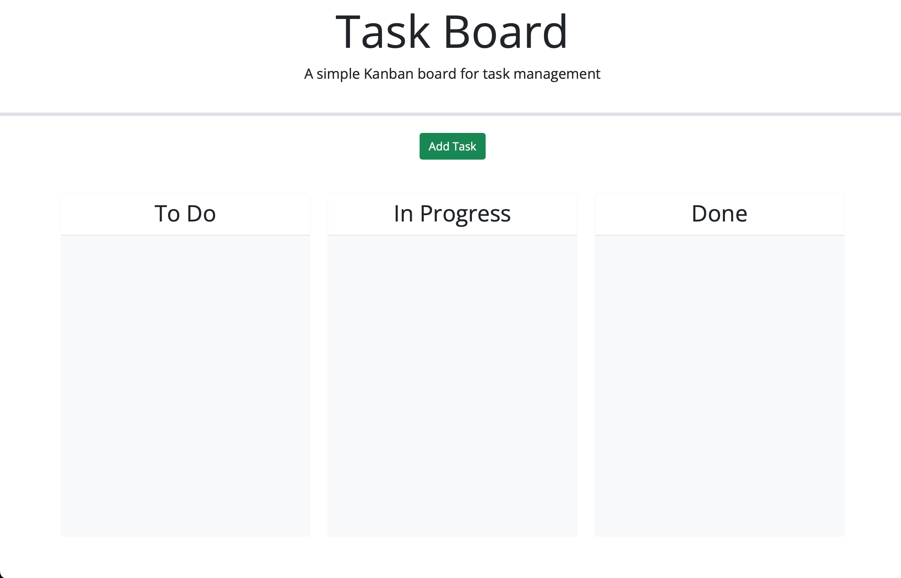

# TaskBoard
The following website is a site that allows users to manage tasks by modifying starter code. The purpose of this is to provide an application to manage tasks and place time into 'To Do', "in Progress", and "done" lanes for more organization.

# Instuctions
Once you opent the intial page, you are brought to a site with three lanes: To Do, In Progress, and Done. When you click the "Add Task", a modal will appear where you can type in the task name, a description of the task, and select the task due date. WHen you exit out of hte modal by clicking on "x" on the top left corner, you will be  brought back to the initial screen with a task-card in the "to do" lane that states the information that ws just inputted

# Features
You can delete a task from the page by clicking the delete button. You are able to drag the task card into any lane once created.

# Screenshots

# Link
https://codecj93.github.io/TaskBoard/